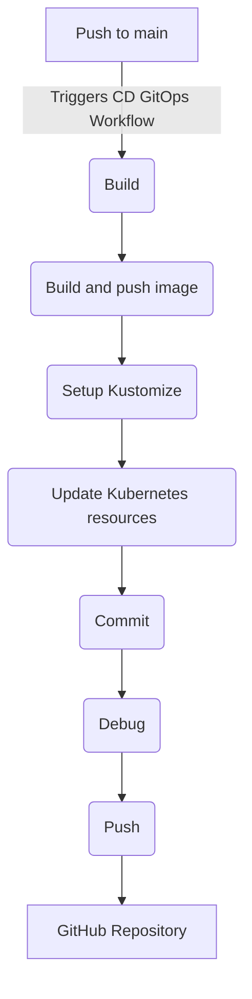

# POC (Proof of Concept) - GitOps

  

## O que é o gitOps? :writing_hand:

GitOps é uma abordagem para a automação de implantações de software que utiliza o Git como fonte única de verdade para a configuração de infraestrutura e aplicações. Com base na ideia de que o estado desejado do sistema é representado como código no repositório Git, o GitOps automatiza o processo de implantação, monitoramento e atualização contínua, sincronizando automaticamente o ambiente com as definições versionadas no Git. Essa prática promove a consistência, rastreabilidade e reversibilidade das mudanças, simplificando a gestão de infraestrutura e facilitando a colaboração entre equipes de desenvolvimento e operações.

## Propósito e resumo da POC :mage:

Este repositório é uma Prova de Conceito (POC) para a implementação de GitOps usando GitHub Actions. O fluxo de trabalho automatiza o pipeline de Implantação Contínua (CD) para uma aplicação de servidor Golang, garantindo que as alterações enviadas para o branch `main` acionem o processo de compilação e implantação.

## Visão geral do Workflow. :fast_forward:
O fluxo de trabalho do GitHub Actions definido em `.github/workflows/cd.yaml` executa as seguintes etapas:

## Links úteis :globe_with_meridians:
- ### [GitHub Actions](https://docs.github.com/pt/actions)
- ### [Kustomize](https://kustomize.io/)
- ### [ArgoCD](https://argoproj.github.io/cd/)
	
## 

  
  

